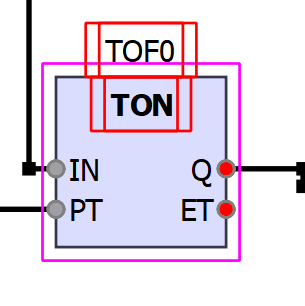
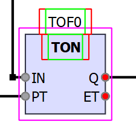
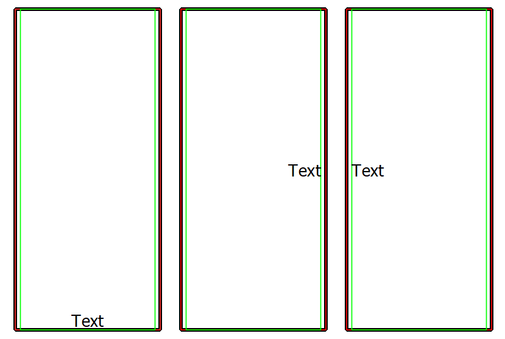

# Расчет boudingRect() для кастомных QGraphicsItem

## Расчет для объектов, размер которых изменяется по границе объекта перетаскиваниями

На графической сцене могут размещаться объекты, с которыми пользователь будет взаимодействовать с помощью механизмов MouseEvent (Move, Press, Release и тд). Часто некоторые действия взаимодействуют с объектом по его границе, например, для изменения размера объекта перетаскиванием. В таких случаях реальная граница объекта может быть слишком узкая для того, чтобы пользователь мог удобно с ней взаимодействовать, поэтому для такого графического объекта отдельно задается поле типа QSizeF (хотя можно высоту и ширину хранить и отдельными полями), в котором хранится реальный рзмер графического объекта и по которому происходит отрисовка методом paint(), а также, как и для всех кастомных QGraphicsItem переопределяется метод boundingRect() такми образом, чтобы вокруг объекта была область в несколько пикселей, оставляющая дополнительное место для реагирования на события мыши, но не отражающаяся на отрисовке объекта (рисунок 1);

Листинг 1. Пример функции boundingRect().
```c++
QRectF CustomGraphicsItem:: boundingRect() const
{
    QRectF grect(0.0, 0.0, m_size.width(), m_size.height()); // Создаем прямоугольник с областью, которую будем отрисовывать в paint()

    return grect.adjusted(-5, -5, +5, +5); // Выставляем некоторый внешний отступ (margin), чтобы область реагирования была больше отрисованной части
}
```

Рисунок 1. Фиолетовой рамкой показан boundingRect объекта.



При таком подходе сам элемент по карте графической сцены будет начинаться не с точки (0;0) в координатах этого элемента, а с точки (-5, -5), то есть с границы именно boundingRect(). А внутри элемента уже рисуем, что хотим.

## Расчет для объектов без интерактивного изменения размеров

На графической сцене или на других графических объектах могут располагаться другие графические объекты, размеры которых расчитываются на основе родительских размеров. При проектировании таких графических объектов встает схожая проблема - необходимы какие-то отступы (буферы), чтобы отрисованный элемент не "прилипал" к границам, в которые он вписывается. Эту задачу можно решать как и с позиции родительского элемента, который будет контролировать позиционирование дочернего элемента так, чтобы соблюдались какие-то установленные отсутпы, но гораздо удобнее, когда эти оступы у дочернего элемента можно настроить сразу и больше о них не беспокоится. 

### Описание проблемы
В качестве примера будет приведен графический объект, отрисовывающий многострочный текст и имеющий настройки выравнивания. При замене текста размер объекта подстраивается под размеры текста, высчитываемые с помощью QFontMetricsF (QFontMetrics), чтобы текст отображался полностью. Если мы используем данный графический объект как некоторую табличку, то все хорошо. Но если мы используем его как контейнер для текста, с помощью которого родительский объект отображает содержимое на всей своей площади, то может возникнуть ситуация, в которой разрешенное для текста место на родительском объекте превышает размеры текста внутри него. Просто размещать текст по центру не получится, так как сломается настройка Align.

### Решение
Для решения возникшей проблемы внутри объекта были разделены размеры:
- Размер текста : минимальный размер объекта, который определяется внутренним текстом и выбранным шрифтом;
- Размер разрешенной области : это максимальный размер, который может занять табличка внутри родительского объекта;
- bounding_rect : это прямоугольник, который задает pading для отрисовываемого текста, чтобы текст не прилепал к границам родительского объекта;

При таком разделении размер текста используется как минимальный размер графического объекта. Размер разрешенной области задается родителем динамически при изменении своих размеров, отрисовка графики внутри графического элемента начинается из точки (padding_x;padding_y) в квадрате с теми же размерами, что и размер разрешенной области, заданной родителем, если он не превышает минимальный размер. boundingRect() в свою очередь возвращает прямоугольную область, начинающуюся в локальной точке (0;0) и с размерами, превышающими размер разрешенной области на padding_x*2 по ширине и padding_y*2 по высоте. Так, мы получаем контролируемое и понятное позиционирование объекта в системе координат родителя и отступы со всех сторон при необходимости, а сама табличка сможет занимать все выделенное ей пространство и корректно позиционировать текст, прижимая его к любой части.

Листинг 2.
```c++
void InteractiveTextItem::updateBounds()
{
    QFontMetricsF fm(m_font);
    int flags = m_innerTextAlign;

    QRectF rect = fm.boundingRect(QRect(), flags, m_innerText);
    m_textRect = QRectF(0, 0, rect.width(), rect.height());

    updateParentBound();
}

QRectF InteractiveTextItem::boundingRect() const
{
    return QRectF(0, 0, m_parentBound.width() + (INTERACTIVE_LABLE_RECT_MARGIN * 2), m_parentBound.height());
}

void InteractiveTextItem::paint(QPainter *painter, const QStyleOptionGraphicsItem * /*opt*/, QWidget * /*w*/)
{
    painter->setRenderHint(QPainter::Antialiasing, true);

    // Рисуем текст
    painter->setRenderHint(QPainter::TextAntialiasing, true);

    painter->setFont(font());
    painter->setPen(QPen(m_textColor));

    uint16_t align = m_innerTextAlign;

    painter->drawText(m_parentBound, align, m_innerText);
}
```

Рисунок 2. Красной рамкой показан boundingRect(), а зеленой - зона отрисовки текста. Размер таблички минимальный.



Рисунок 3. Рамки обозначают то же, что и на рисунке 2, но здесь задает разрешенный размер текста на всю область родительского объекта.

